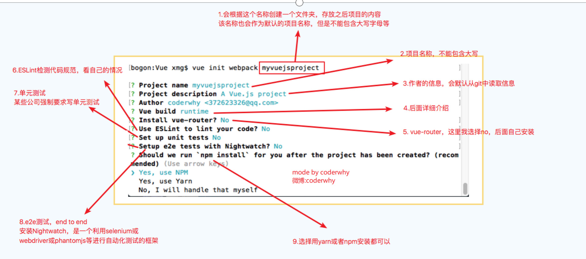
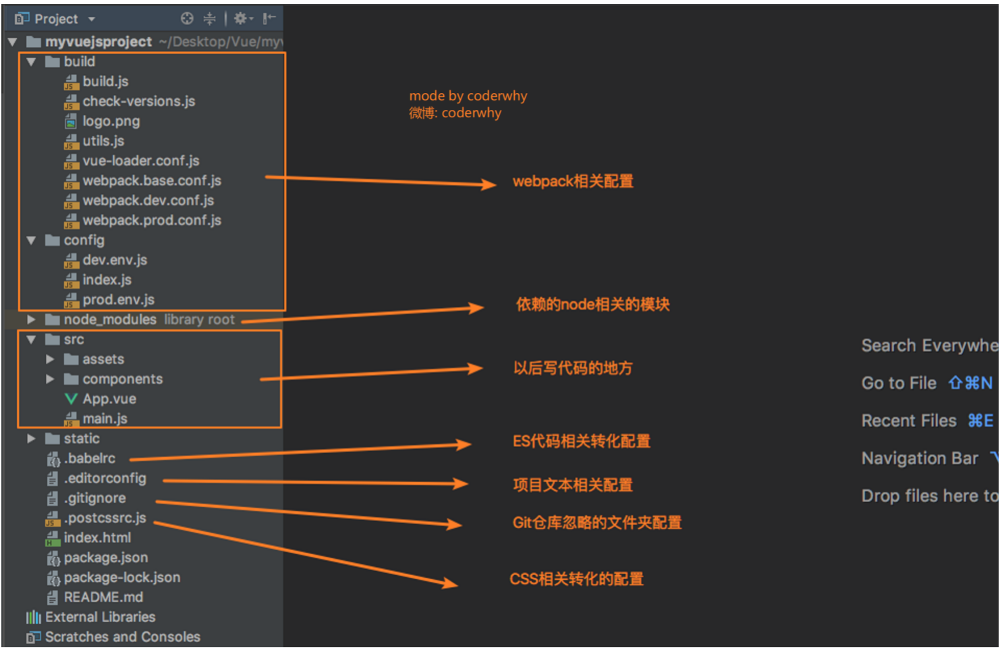
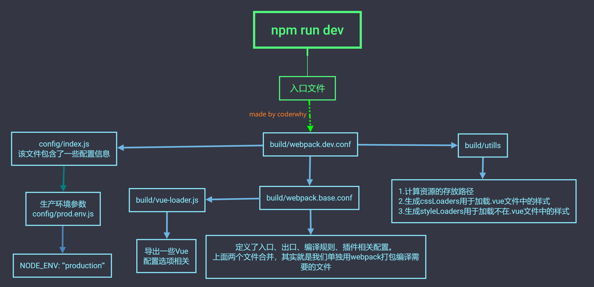

====================
Vue-CLI详解
====================

什么是Vue Cli 
===========================
Vue CLI是一个官方发布 vue.js 项目脚手架,使用 vue-cli 可以快速搭建Vue开发环境以及对应的webpack配置.

官方的文档： vue-cli_

..  _vue-cli: https://cli.vuejs.org/zh/guide/

安装vue cli
===========================

-----------------------
安装vue cli 最新版本
-----------------------

.. code-block:: bash

    npm install -g @vue/cli
    # OR
    yarn global add @vue/cli

如果你想按照vue cli2的方式初始化项目，还需要如下安装

.. code-block:: bash 

    npm install -g @vue/cli-init

-----------------------
初始化项目
-----------------------

**使用最新的方式创建项目**

.. code-block:: bash 

    vue create  my-project1

**创建vue-cli2的方式**

.. code-block:: bash 

    vue init webpack my-project2

-----------------------
vue cli2 详解
-----------------------
创建过程会进行一系列的咨询。如下图： 

各个目录说明如下：

构建命令说明
======================

-----------------------
npm run build
-----------------------

.. image:: ../images/build.png

-----------------------
npm run dev
-----------------------

Vue CLI3
======================

-----------------------
cli3和cli2的区别
-----------------------

- vue-cli 3 与 2 版本有很大区别
- vue-cli 3 是基于 webpack 4 打造，vue-cli 2 还是 webapck 3
- vue-cli 3 的设计原则是“0配置”，移除的配置文件根目录下的，build和config等目录
- vue-cli 3 提供了 vue ui 命令，提供了可视化配置，更加人性化
- 移除了static文件夹，新增了public文件夹，并且index.html移动到public中

-----------------------
cli3的配置
-----------------------
cli3的配置可以通过vue ui进行插件的安装和配置文件管理。
