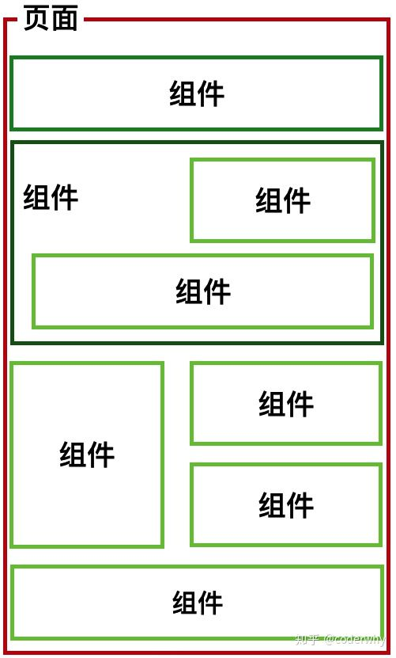
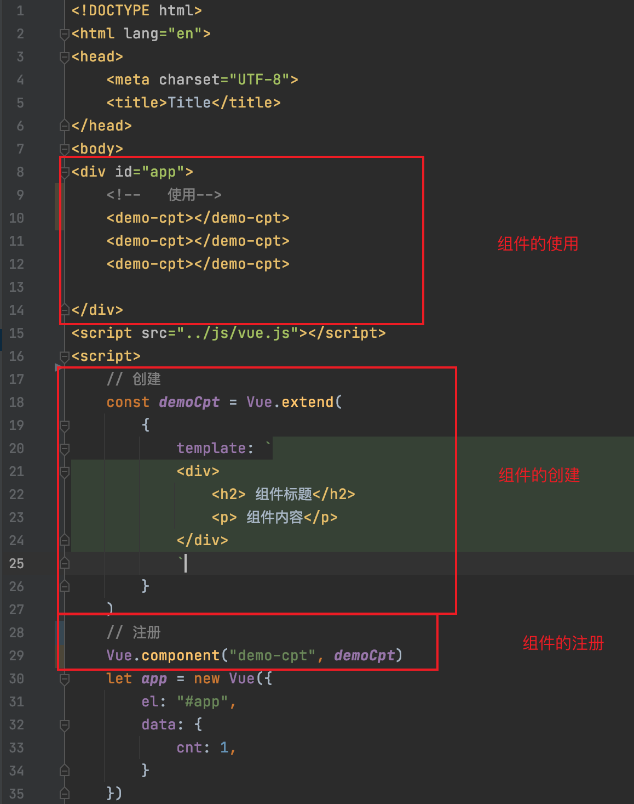
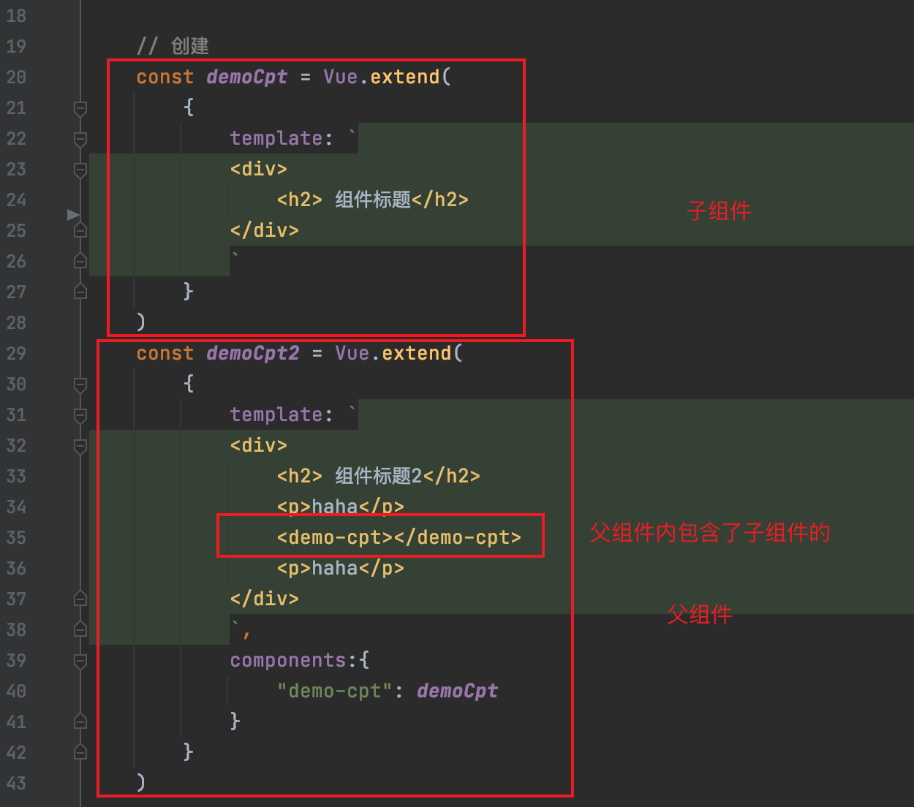

====================
组件化开发
====================

认识组件化
===========================

-----------------------
什么是组件化
-----------------------

组件化是讲一个页面进行拆分为一个一个小的功能块，每个功能块完成对应的功能，如下图。

-----------------------
组件化的思想
-----------------------

- 它提供了一种抽象，让我们可以开发出一个个独立可复用的小组件来构造我们的应用。
- 任何的应用都会被抽象成一颗组件树。

注册组件
===========================

-----------------------
基本步骤
-----------------------

组件的注册分如下3个阶段

#. 创建组件构造器
#. 注册组件
#. 使用组件

-----------------------
注册代码图
-----------------------

#. 其中调用Vue.extend()创建的是一个组件构造器。 
#. 调用Vue.component()是将刚才的组件构造器注册为一个组件。
#. 组件必须挂载在某个Vue实例下，否则它不会生效。

-----------------------
详细代码实现
-----------------------

.. literalinclude:: ../../中级学习/01-组件化开发/01-组件基本使用.html
   :encoding: utf-8
   :language: html
   :emphasize-lines: 1
   :linenos:

组件其他补充
===========================

-----------------------
全局组件
-----------------------
通过Vue.component()注册的组件为全局的组件。意味这个组件是可以全局使用的。

.. code-block:: javascript

    Vue.component("demo-cpt",demoCpt)

-----------------------
局部组件
-----------------------
如果在特定的vue下的components属性指定的组件为局部组件，只能在特定的父组件使用的。

.. code-block:: javascript

    let app = new Vue({
            el: "#app",
            data: {
                cnt: 1,
            },
            components:{
                "demo-cpt2": demoCpt2
            }
        })

-----------------------
父子组件
-----------------------
组件和组件是有一定的层次关系的， 其中其中父子组件的是而非常重要的关系。

代码如下: 

.. literalinclude:: ../../中级学习/01-组件化开发/03-父子组件.html
   :encoding: utf-8
   :language: html
   :emphasize-lines: 1
   :linenos:

-----------------------
模块的分离写法
-----------------------
上面我们可以看到写一个组件内部还包含了html的代码，非常不方便管理和维护。可以通过如下方式进行改造。

2中方式在代码中体现：

.. literalinclude:: ../../中级学习/01-组件化开发/04-组件模块代码分离.html
   :encoding: utf-8
   :language: html
   :emphasize-lines: 1
   :linenos:

组件数据存放
===========================
组件内的数据有个data属性，但是这个是一个函数的，通过这个函数返回一个dict对象即可。

详细代码如下： 

.. literalinclude:: ../../中级学习/01-组件化开发/05-组件数据访问.html
   :encoding: utf-8
   :language: html
   :emphasize-lines: 1
   :linenos:

.. note:: 组件的data必须是一个函数的，不能是通过的字典，因为我们组件是复用的，组件复用后的数据一定是独立的。

父子组件通信
===========================
官方文档中给出了父子组件的通信方式。

- 通过props向子组件传递数据
- 通过事件向父组件发送消息

.. image:: ../images/父子通信.png

-----------------------
父级向子级传递
-----------------------
父组件向子组件创建数据，可以通过子组件提供props来传递。参考如下： 

.. literalinclude:: ../../中级学习/01-组件化开发/06-组件通信-父向子组件的通信.html
   :encoding: utf-8
   :language: html
   :emphasize-lines: 1
   :linenos:

-----------------------
子级向父级传递
-----------------------
自组件向父组件传递数据，通过发射事件，然后父组件绑定事件即可。参考如下： 

.. literalinclude:: ../../中级学习/01-组件化开发/07-组件通信-子向父组件的通信.html
   :encoding: utf-8
   :language: html
   :emphasize-lines: 1
   :linenos:

-----------------------
父访问子组件数据
-----------------------
父组件访问子组件：使用$children或$refs

.. literalinclude:: ../../中级学习/01-组件化开发/09-组件访问数据父访问子.html
   :encoding: utf-8
   :language: html
   :emphasize-lines: 1
   :linenos:

-----------------------
子访问父组件数据
-----------------------
子组件访问父组件：使用$parent

.. literalinclude:: ../../中级学习/01-组件化开发/09-组件访问数据父访问子.html
   :encoding: utf-8
   :language: html
   :emphasize-lines: 1
   :linenos:

插槽slot
========================

-----------------------
编译作用域
-----------------------

父组件模板的所有东西都会在父级作用域内编译；子组件模板的所有东西都会在子级作用域内编译。

-----------------------
为什么使用slot
-----------------------

- 组件的插槽也是为了让我们封装的组件更加具有扩展性。
- 让使用者可以决定组件内部的一些内容到底展示什么。

-----------------------
slot的基本使用
-----------------------

在组件的模板定义中引入slot即可。

.. literalinclude:: ../../中级学习/01-组件化开发/11-组件插槽的基本使用.html
   :encoding: utf-8
   :language: html
   :emphasize-lines: 1
   :linenos:

-----------------------
具名slot
-----------------------
当子组件的功能复杂时，子组件的插槽可能并非是一个,怎么方便控制用户想替换哪个slot？

这就需要给slot起个名字，让用户选择给那个slot位置进行替换。

.. literalinclude:: ../../中级学习/01-组件化开发/12-组件插槽的具名使用.html
   :encoding: utf-8
   :language: html
   :emphasize-lines: 1
   :linenos: