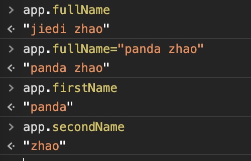

====================
基础语法
====================

插值操作
===========================

通过插值操作可以完成vue对象的数据，填充到html中去。

.. code-block:: vue

    <h2> {{ message }} </h2>

-----------------------
v-once
-----------------------
可以完成vue仅仅一次的数据绑定，后续的数据修改不在同步页面。

-----------------------
v-html
-----------------------
可以将数据中的html内容，以html展示到页面上。

.. literalinclude:: ../../基础学习/02-插值操作/03-v-html使用.html
   :encoding: utf-8
   :language: html
   :emphasize-lines: 18-22,12-14
   :linenos:
   :lines: 1,4-

-----------------------
v-text
-----------------------
可以将数据中的html内容，以text展示到页面上。

.. literalinclude:: ../../基础学习/02-插值操作/03-v-text使用.html
   :encoding: utf-8
   :language: html
   :emphasize-lines: 18-22,12-14
   :linenos:
   :lines: 1,4-

-----------------------
v-pre
-----------------------
用于跳过这个元素和他子元素的编译过程，用于展示原本内容。

-----------------------
v-cloak
-----------------------
某些情况下 ，浏览器可能会直接展示未编译的mustache标签。 通过此可以不展示这些信息。

.. literalinclude:: ../../基础学习/02-插值操作/05-v-cloak使用.html
   :encoding: utf-8
   :language: html
   :emphasize-lines: 18-22,12-14
   :linenos:
   :lines: 1,4-

绑定属性
===========================
v-bind可以绑定属性。

-----------------------
基本使用
-----------------------

.. literalinclude:: ../../基础学习/03-动态绑定属性/01-v-bind基本使用.html
   :encoding: utf-8
   :language: html
   :emphasize-lines: 18-22,12-14
   :linenos:
   :lines: 1,4-

-----------------------
动态绑定class
-----------------------

.. literalinclude:: ../../基础学习/03-动态绑定属性/02-v-bind动态class绑定.html
   :encoding: utf-8
   :language: html
   :emphasize-lines: 18-22,12-14
   :linenos:
   :lines: 1,4-

-----------------------
动态绑定style
-----------------------

.. literalinclude:: ../../基础学习/03-动态绑定属性/03-v-bind动态style绑定.html
   :encoding: utf-8
   :language: html
   :emphasize-lines: 18-22,12-14
   :linenos:
   :lines: 1,4-

-----------------------
v-for和v-bind作业
-----------------------

.. literalinclude:: ../../基础学习/03-动态绑定属性/04-作业for和bind.html
   :encoding: utf-8
   :language: html
   :emphasize-lines: 18-22,12-14
   :linenos:
   :lines: 1,4-

计算属性
===========================
可以根据已有的属性生成其他属性。

-----------------------
基本使用
-----------------------

.. literalinclude:: ../../基础学习/04-计算属性/01-计算属性基本使用.html
   :encoding: utf-8
   :language: html
   :emphasize-lines: 18-22,12-14
   :linenos:
   :lines: 1,4-

-----------------------
复杂使用
-----------------------

.. literalinclude:: ../../基础学习/04-计算属性/02-计算属性复杂使用.html
   :encoding: utf-8
   :language: html
   :emphasize-lines: 18-22,12-14
   :linenos:
   :lines: 1,4-

-----------------------
getter和setter
-----------------------

.. literalinclude:: ../../基础学习/04-计算属性/03-计算属性的getter和setter.html
   :encoding: utf-8
   :language: html
   :emphasize-lines: 18-22,12-14
   :linenos:
   :lines: 1,4-

-----------------------
计算属性和methods的对比
-----------------------
计算属性是缓存的， 方法是不缓存的。

.. literalinclude:: ../../基础学习/04-计算属性/05-计算属性和methods的对比.html
   :encoding: utf-8
   :language: html
   :emphasize-lines: 18-22,12-14
   :linenos:
   :lines: 1,4-

事件监听
===========================
事件监听用于在用户点击、拖拽等场景。

-----------------------
基本使用
-----------------------

.. literalinclude:: ../../基础学习/06-事件监听/01-事件监听的基本使用.html
   :encoding: utf-8
   :language: html
   :emphasize-lines: 18-22,12-14
   :linenos:
   :lines: 1,4-

-----------------------
参数传递
-----------------------

.. literalinclude:: ../../基础学习/06-事件监听/02-事件监听的参数传递.html
   :encoding: utf-8
   :language: html
   :emphasize-lines: 18-22,12-14
   :linenos:
   :lines: 1,4-

-----------------------
修饰符
-----------------------

.. literalinclude:: ../../基础学习/06-事件监听/03-修饰符.html
   :encoding: utf-8
   :language: html
   :emphasize-lines: 18-22,12-14
   :linenos:
   :lines: 1,4-

.. image:: ../images/事件冒泡.png

条件判断
===========================

-----------------------
v-if
-----------------------
简单的判定

.. literalinclude:: ../../基础学习/07-条件判断/01-v-if基本使用.html
   :encoding: utf-8
   :language: html
   :emphasize-lines: 18-22,12-14
   :linenos:
   :lines: 1,4-

-----------------------
v-else-if
-----------------------
稍微复杂的判定

.. literalinclude:: ../../基础学习/07-条件判断/02-v-else-if基本使用.html
   :encoding: utf-8
   :language: html
   :emphasize-lines: 18-22,12-14
   :linenos:
   :lines: 1,4-

-----------------------
用户登录案例
-----------------------
进行一个用户登录切换的案例

.. literalinclude:: ../../基础学习/07-条件判断/03-用户登录案例.html
   :encoding: utf-8
   :language: html
   :emphasize-lines: 18-22,12-14
   :linenos:
   :lines: 1,4-