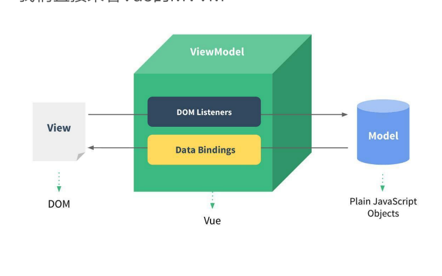
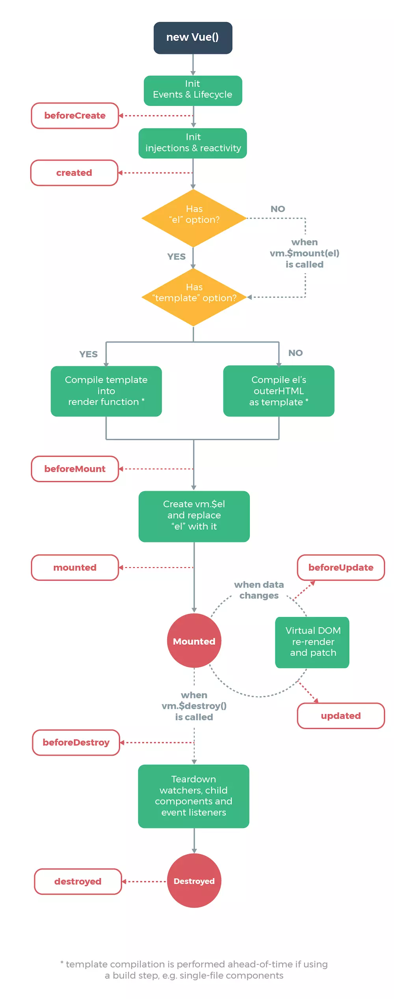

====================
邂逅vue
====================

遇见vue
===========================

----------------------------
为什么学习vuejs
----------------------------

vue学习的原因很多，可能有如下的集中原因：

- 公司将原来的项目进行vue重构
- 公司使用vue技术栈
- 大量前段工作岗位对vue有一定要求
- vue非常火，国人开发维护。

----------------------------
简单认识vue
----------------------------
Vue (读音 `/vjuː/`)

----------------------------
vue的特点
----------------------------

- vue是渐进式框架的
- 解耦视图和数据
- 前段路由技术
- 状态管理
- 虚拟dom

安装Vue
===========================

安装方式比较多

----------------------------
cdn引入
----------------------------
cdn方式推荐代码部署在服务器上面的比较好， 让用户可以使用cdn技术快速访问到文件。

.. code-block:: html

   <!-- 开发环境版本，包含了有帮助的命令行警告 --> 
   
   <!-- 生产环境版本，优化了尺寸和速度 -->
   

----------------------------
下载引入
----------------------------
下载文件放到工程目录，然后进行引入方式。

.. code-block:: html

   

----------------------------
npm安装
----------------------------
npm命令安装vue。

.. code-block:: bash

   npm install vue  

----------------------------
cli和npm结合
----------------------------
后续通过webpack和CLI的使用，我们使用该方式。

体验vue
===========================

----------------------------
hello vue
----------------------------
通过简单的hello vue 展示一个定义的数据。

.. literalinclude:: ../../基础学习/01-初体验/01-hellovuejs.html
   :encoding: utf-8
   :language: html
   :emphasize-lines: 18-22,12-14
   :linenos:
   :lines: 1,4-

可以在浏览器进行数据修改，然后自动页面修改。

----------------------------
vue显示列表
----------------------------

.. literalinclude:: ../../基础学习/01-初体验/02-列表展示.html
   :encoding: utf-8
   :language: html
   :emphasize-lines: 18-22,12-14
   :linenos:
   :lines: 1,4-

----------------------------
vue简单计数器
----------------------------

.. literalinclude:: ../../基础学习/01-初体验/03-计数器.html
   :encoding: utf-8
   :language: html
   :emphasize-lines: 18-22,12-14
   :linenos:
   :lines: 1,4-

mvvm架构
===========================

mvvm 是model view  view model 的合称。

----------------------------
data和vue对象的分离
----------------------------

----------------------------
vue中的mvvm
----------------------------

.. image::  ../imgs/mvvm.png

View层：
    视图层
    在我们前端开发中，通常就是DOM层。
    主要的作用是给用户展示各种信息。

Model层：
    数据层
    数据可能是我们固定的死数据，更多的是来自我们服务器，从网络上请求下来的数据。
    在我们计数器的案例中，就是后面抽取出来的obj，当然，里面的数据可能没有这么简单。

VueModel层：
    视图模型层
    视图模型层是View和Model沟通的桥梁。
    一方面它实现了Data Binding，也就是数据绑定，将Model的改变实时的反应到View中
    另一方面它实现了DOM Listener，也就是DOM监听，当DOM发生一些事件(点击、滚动、touch等)时，可以监听到，并在需要的情况下改变对应的Data

vue的options
===========================

vue的options有很多

主要的有以下几个

- el: 决定vue实例管理哪个dom。
- data: vue实例对应的数据对象。
- methods: 定义方法，方便其他地方调用。

mvvm生命周期
===========================

